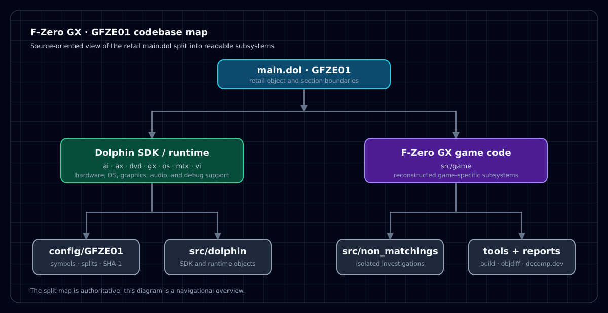

# F-Zero GX — GFZE01 matching decompilation

     

This repository is a from-scratch, matching decompilation project for the NTSC-U GameCube release of F-Zero GX (`GFZE01`). The goal is source code that rebuilds the original code and data as closely as possible while keeping the source readable and provenance explicit.

It builds `main.dol`:

| Version | Game ID | SHA-1 |
| --- | --- | --- |
| NTSC-U | `GFZE01` | `421c88106697d3275a3fc26fb7a01bf6d816b271` |

The SHA-1 is the checksum of the matching input recorded in [`config/GFZE01/build.sha1`](config/GFZE01/build.sha1).

## Scope

The current matching target is the executable `main.dol`. It is the Dolphin
SDK, MSL, MetroTRK, and middleware portion of GFZE01; the game-specific code
in the disc REL modules is outside this target. Progress metrics therefore
refer to `main.dol`, not to the complete F-Zero GX game image.

## Current progress

Progress is published through the GitHub Actions `GFZE01_report` artifact and tracked on [decomp.dev](https://decomp.dev/karamzov123/fzero-gx-decomp). The public report separates:

- **Exact natural C** — the project mission metric.
- **C-expressed** — supplemental fuzzy progress for C-backed functions.
- **Diagnostic objdiff** — whole-binary parity, including hand-written assembly; useful for build health, but not the decompilation headline.

See the [NATC operations contract](docs/NATC-OPERATIONS.md) for canonical state paths, admission, context, probe, and eligibility rules.
See the [GFZE01 symbols](config/GFZE01/symbols.txt), [split map](config/GFZE01/splits.txt), and [split documentation](docs/splits.md) for the project inventory.

*The diagram is a navigational overview; the [split map](config/GFZE01/splits.txt) remains authoritative for retail objects and addresses.*

## Project layout

- `src/` — reconstructed C and assembly sources
- `config/GFZE01/` — build version, symbols, and split definitions
- `tools/` — public build/report tooling
- `tests/` — regression tests for public tooling
- `docs/` — setup, split, provenance, and resource documentation
- `.github/workflows/report.yml` — trusted-main progress report workflow

The retail binary, proprietary compiler distribution, and other non-redistributable inputs are intentionally not included. A local build requires legally obtained matching inputs and the appropriate GameCube toolchain.

## Getting started

This is an active matching project rather than a ready-to-run ROM build. Start with:

1. Read [Getting Started](docs/getting_started.md).
2. Review [Dependencies](docs/dependencies.md).
3. Inspect `config/GFZE01/splits.txt` and `config/GFZE01/symbols.txt`.
4. Read the [reference and readability policy](docs/REFERENCE-POLICY.md).
5. Check [decomp.dev](https://decomp.dev/karamzov123/fzero-gx-decomp) for progress and the repository Actions tab for report runs.

For individual difficult functions, [decomp.me](https://decomp.me) provides shareable matching scratches; it works on individual functions, not full binaries.

## Contributing

Please keep changes focused and reproducible. Preserve the existing symbol/split conventions, do not commit copyrighted game assets or private environment files, and document adapted code with provenance as described in the policy. Discussion and review are welcome through the GameCube/Wii decompilation community.

## Resources and attributions

This project builds on the following public resources and tools:

- [decomp-toolkit](https://github.com/encounter/decomp-toolkit) — GameCube/Wii project tooling and DOL splitting
- [dtk-template](https://github.com/encounter/dtk-template) — standard GameCube/Wii project structure and workflow reference
- [objdiff](https://github.com/encounter/objdiff) — object comparison and progress reporting
- [wibo](https://github.com/decompals/wibo) — Win32 compatibility wrapper used for MWCC workflows on Linux
- [sjiswrap](https://github.com/encounter/sjiswrap) — Shift-JIS compiler-input wrapper
- [decomp.me](https://decomp.me) — collaborative function-level matching scratches
- [decomp.dev](https://decomp.dev) — progress-report ecosystem
- [doldecomp/dolsdk2001](https://github.com/doldecomp/dolsdk2001) — Dolphin SDK matching reference
- [doldecomp/melee](https://github.com/doldecomp/melee) — reference decompilation tree
- [doldecomp/sms](https://github.com/doldecomp/sms) — Super Mario Sunshine reference tree
- [doldecomp/mkdd](https://github.com/doldecomp/mkdd) — Mario Kart: Double Dash!! reference tree

See [ONLINE-RESOURCES.md](docs/ONLINE-RESOURCES.md) and [REFERENCE-POLICY.md](docs/REFERENCE-POLICY.md) for the detailed attribution and adaptation rules.
